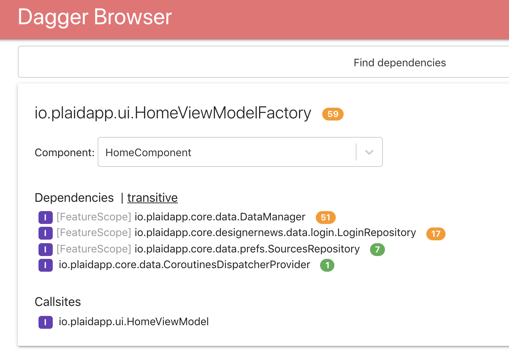

# Dagger Browser

Dagger Browser is a progressive web app for easily navigating a project's Dagger graph. The graph data is populated from a Dagger [SPI](https://dagger.dev/spi.html) plugin, and the browser is built using
[CRA (create-react-app)](https://github.com/facebook/create-react-app) with Typescript.



## Trying a sample

Check out the [demo site](https://snapchat.github.io/dagger-browser/plaid) built from the open source 
[Plaid](https://github.com/android/plaid) app.

The [plugin/sample](plugin/sample)
directory contains a fork of a [simple example](https://github.com/google/dagger/tree/master/examples/simple) from the Dagger repo. 

You can run `./run.sh` to generate the dagger components manifest for this example and display in the Dagger Browser.

## Using Dagger Browser in your app

To build a Dagger Browser site for your project, you'll need to generate json files for your project's Dagger components.

To get started:

1. Look up the latest version of the processor plugin in Maven Central:


2. Add a dependency on `com.snap.daggerbrowser:daggerbrowser-processor` to any Gradle modules in your project that process Dagger components:
```groovy
allprojects {
  repositories {
    mavenCentral()
  }
}
dependencies {
  kapt "com.snap.daggerbrowser:daggerbrowser-processor:LATEST_VERSION"
}  
```
3. Build your project. The plugin will generate json files for each Dagger component.

4. Use [scripts/mkmanifest.sh](https://github.com/Snapchat/dagger-browser/blob/master/scripts/mkmanifest.sh) to aggregate the component json files into a ComponentsManifest.json.

5. Open a [Dagger Browser instance](https://snapchat.github.io/dagger-browser/home/#/), and drag-and-drop your ComponentsManifest.json file to load it.

6. Alternatively, build a Dagger Browser instance from source. Checkout out the `dagger-browser` project
```
$: git clone git@github.com:Snapchat/dagger-browser.git
```
7. Build Dagger Browser using your generated json files:
```
cd dagger-browser
./run.sh ../my_project/
```
